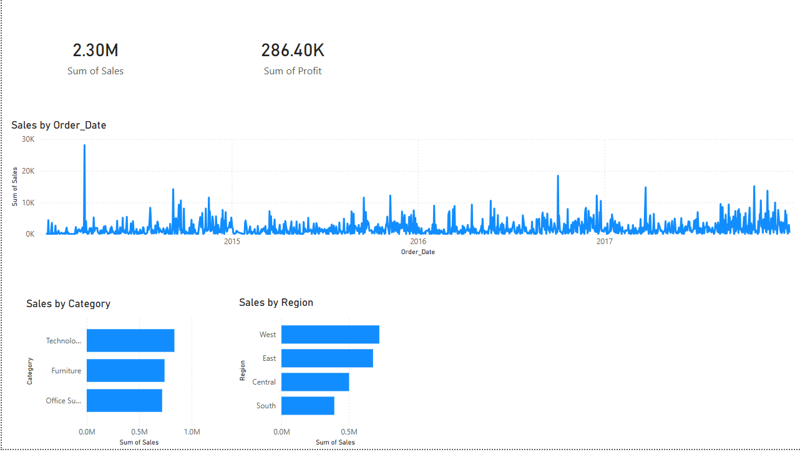

# Retail Sales Data Pipeline & BI Dashboard

End-to-end data pipeline that extracts, transforms, and loads retail sales data, then visualizes business KPIs in an interactive Power BI dashboard.

---

## Problem Statement

Retail businesses generate massive transactional data but struggle to derive quick, actionable insights. This project automates the entire data workflow — from raw data to a decision-ready dashboard — eliminating manual reporting effort.

---

## Tech Stack

`Python` `SQL Server` `Power BI` `Pandas` `SQLAlchemy` `pyodbc`

---

## Key Business Insights

- **Technology** category generates the highest sales revenue
- **West region** contributes the most to overall revenue
- Sales show a **fluctuating but upward trend** over time — growth opportunity identified
- Processed and analyzed **10,000+ records** with automated data quality checks

---

## Dashboard Preview



---

## Project Structure
Retail-Data-Pipeline/
├── scripts/         # ETL pipeline scripts
├── sql/             # SQL queries for extraction
├── data/            # Cleaned dataset output
├── dashboard/       # Power BI .pbix + screenshot
├── logs/            # Pipeline execution logs
└── requirements.txt

---

## How to Run

```bash
pip install -r requirements.txt
python scripts/main.py
```

---

## Skills Demonstrated

- ETL pipeline design and automation
- SQL query optimization
- Data cleaning and validation at scale
- KPI dashboard development in Power BI
- Business insight generation from raw transactional data